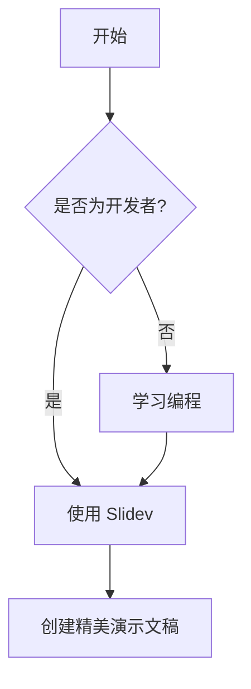

---
# Slidev 主题
theme: seriph
# 背景图片
background: https://cover.sli.dev
# 演示文稿信息
title: Slidev - 开发者的演示文稿工具
info: |
  ## Slidev 完整指南
  为开发者设计的演示文稿工具
  
  基于 Vue.js 和 Vite 构建
# 应用 UnoCSS 类到当前幻灯片
class: text-center
# 绘图功能
drawings:
  persist: false
# 幻灯片过渡效果
transition: slide-left
# 启用 MDC 语法
mdc: true
---

# Slidev
## 开发者的演示文稿工具

为开发者量身定制的演示文稿解决方案

<div @click="$slidev.nav.next" class="mt-12 py-1" hover:bg="white op-10">
  按空格键进入下一页 <carbon:arrow-right />
</div>

<div class="abs-br m-6 text-xl">
  <button @click="$slidev.nav.openInEditor()" title="在编辑器中打开" class="slidev-icon-btn">
    <carbon:edit />
  </button>
  <a href="https://github.com/slidevjs/slidev" target="_blank" class="slidev-icon-btn">
    <carbon:logo-github />
  </a>
</div>

---
transition: fade-out
---

# 目录

<Toc maxDepth="2" />

---

# 什么是 Slidev？

Slidev 是一个专为开发者设计的演示文稿工具

- 📝 **基于 Markdown** - 使用 Markdown 编写内容，专注于内容本身
- 🎨 **可主题化** - 主题可以共享并通过 npm 包使用
- 🧑‍💻 **开发者友好** - 内置代码高亮、实时编辑等功能
- 🤹 **交互式** - 嵌入 Vue 组件来增强你的表达
- 🎥 **录制** - 内置录制和摄像头视图
- 📤 **便携** - 导出为 PDF、PNG 或可托管的 SPA
- 🛠 **可配置** - 在 Markdown 中配置所有内容

---
layout: default
---

# 快速开始

## 安装

使用 npm、yarn 或 pnpm 创建新项目：

```bash
npm create slidev@latest
```

```bash
yarn create slidev
```

```bash
pnpm create slidev
```

然后按照提示操作！

---

# 基本语法

## 幻灯片分隔符

使用 `---` 分隔幻灯片：

```markdown
# 幻灯片 1

这是第一张幻灯片

---

# 幻灯片 2

这是第二张幻灯片
```

---

# 前置元数据 (Frontmatter)

每张幻灯片都可以有自己的前置元数据：

```yaml
---
layout: center
background: './images/background.png'
class: 'text-white'
---

# 居中布局的幻灯片
```

---

# 代码高亮

Slidev 内置了强大的代码高亮功能：

```ts {all|2|1-6|9|all}
interface User {
  id: number
  firstName: string
  lastName: string
  role: string
}

function updateUser(id: number, update: User) {
  const user = getUser(id)
  const newUser = { ...user, ...update }  
  saveUser(id, newUser)
}
```

---

# 用户界面

## 导航

- **下一张幻灯片**: <kbd>space</kbd> / <kbd>tab</kbd> / <kbd>right</kbd> / <kbd>j</kbd>
- **上一张幻灯片**: <kbd>shift</kbd><kbd>space</kbd> / <kbd>left</kbd> / <kbd>k</kbd>
- **开始**: <kbd>home</kbd>
- **结束**: <kbd>end</kbd>

## 演示者模式

按 <kbd>o</kbd> 键进入演示者模式，或访问 `http://localhost:3030/presenter/`

---

# 动画效果

## 点击动画

使用 `v-click` 指令创建点击动画：

<div v-click>

这个元素会在点击后出现

</div>

<div v-click>

这个元素会在第二次点击后出现

</div>

---

# 主题和插件

## 内置主题

- `default` - 简洁的默认主题
- `seriph` - 优雅的衬线字体主题
- `apple-basic` - 类似 Apple 风格的主题
- `bricks` - 砖块风格主题

## 安装主题

```bash
npm install @slidev/theme-seriph
```

然后在前置元数据中使用：

```yaml
---
theme: seriph
---
```

---

# 组件

## 内置组件

Slidev 提供了许多内置组件：

- `<Toc />` - 目录
- `<Tweet />` - 嵌入推文
- `<Youtube />` - 嵌入 YouTube 视频
- `<CodeRunner />` - 代码运行器

## 自定义组件

在 `components/` 目录下创建 Vue 组件：

```vue
<!-- components/MyComponent.vue -->
<template>
  <div class="my-component">
    <h1>{{ title }}</h1>
  </div>
</template>

<script setup>
defineProps(['title'])
</script>
```

---

# 布局

## 内置布局

- `default` - 默认布局
- `center` - 居中布局
- `cover` - 封面布局
- `intro` - 介绍布局
- `section` - 章节布局
- `quote` - 引用布局
- `fact` - 事实布局

## 使用布局

```yaml
---
layout: center
---

# 居中的标题
```

---
layout: center
---

# 导出和部署

## 导出为 PDF

```bash
slidev export
```

## 导出为 PNG

```bash
slidev export --format png
```

## 构建 SPA

```bash
slidev build
```

---

# 高级功能

## 绘图和注释

- 按 <kbd>d</kbd> 开始绘图
- 按 <kbd>c</kbd> 清除绘图
- 按 <kbd>e</kbd> 擦除

## 录制

- 按 <kbd>r</kbd> 开始/停止录制
- 支持摄像头视图
- 导出为视频文件

---

# 自定义配置

## Vite 配置

在 `vite.config.ts` 中自定义 Vite 配置：

```ts
import { defineConfig } from 'vite'

export default defineConfig({
  // 你的配置
})
```

## UnoCSS 配置

在 `uno.config.ts` 中配置 UnoCSS：

```ts
import { defineConfig } from 'unocss'

export default defineConfig({
  // 你的配置
})
```

---

# 特色功能

## LaTeX 支持

Slidev 内置 LaTeX 支持，由 KaTeX 驱动：

$$
\int_{-\infty}^{\infty} e^{-x^2} dx = \sqrt{\pi}
$$

## Mermaid 图表



---

# Monaco 编辑器

Slidev 集成了 Monaco 编辑器，支持实时代码编辑：

```ts {monaco}
function fibonacci(n: number): number {
  if (n <= 1) return n
  return fibonacci(n - 1) + fibonacci(n - 2)
}

console.log(fibonacci(10))
```

---

# 远程访问

启用远程访问功能：

```bash
slidev --remote
```

然后其他人可以通过网络访问你的演示文稿

## 特性

- 实时同步
- 演示者控制
- 观众模式

---
layout: center
---

# 总结

Slidev 是一个强大而灵活的演示文稿工具

- ✅ 基于 Markdown，易于编写
- ✅ 丰富的主题和布局选择
- ✅ 强大的代码高亮和编辑功能
- ✅ 支持动画、绘图、录制等高级功能
- ✅ 可导出多种格式
- ✅ 完全可定制

---
layout: end
---

# 谢谢！

开始使用 Slidev 创建你的演示文稿吧！

[文档](https://sli.dev) · [GitHub](https://github.com/slidevjs/slidev) · [演示](https://demo.sli.dev)
