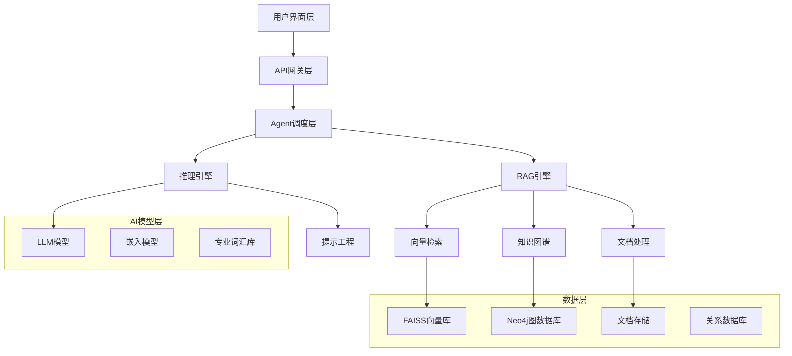

---
# Slidev 主题
theme: seriph
# 背景图片
background: https://images.unsplash.com/photo-1565008447742-97f6f38c985c?ixlib=rb-4.0.3&auto=format&fit=crop&w=1920&q=80
# 演示文稿信息
title: 钢铁行业AI决策中心 - RAG Agent系统
info: |
  ## 钢铁行业AI决策中心
  基于RAG技术的智能决策支持系统
  
  融合检索增强生成与专业知识图谱
# 应用 UnoCSS 类到当前幻灯片
class: text-center
# 绘图功能
drawings:
  persist: false
# 幻灯片过渡效果
transition: slide-left
# 启用 MDC 语法
mdc: true
---

# CastIron 助铁 
## 钢铁行业AI决策中心
### RAG Agent智能决策支持系统

基于检索增强生成技术的垂直领域AI解决方案

  

    <carbon:industry class="text-4xl mb-2 text-blue-600" />
    
钢铁行业专精

  

  

    <carbon:ai-results class="text-4xl mb-2 text-green-600" />
    
RAG技术驱动

  

  

    <carbon:decision-tree class="text-4xl mb-2 text-purple-600" />
    
智能决策支持

  

  按空格键进入下一页 <carbon:arrow-right />

---
transition: fade-out
---

# 目录

<Toc maxDepth="2" columns="2" />

---

# 作品信息

  

    <h2 class="text-2xl font-bold mb-4 text-blue-600">项目概览</h2>
    

      
<strong>项目名称:</strong> CastIron 助铁 ｜ 钢铁行业AI决策中心

      
<strong>技术架构:</strong> RAG Agent系统

      
<strong>团队规模:</strong> 3人

      
<strong>项目状态:</strong> MVP已完成

    

  

  

    <h2 class="text-2xl font-bold mb-4 text-green-600">目标用户</h2>
    

      
🏭 生产管理者

      
🔧 技术专家

      
💼 采购人员

      
📊 市场分析师

      
🛠️ 设备维护

      
🌱 环保专家

    

  

  <h3 class="font-bold mb-2">核心价值主张</h3>
  
从"信息检索"到"智能决策" - 为钢铁行业提供专业化AI决策支持系统

---
layout: section
---

# 项目背景
## 钢铁行业的数字化转型需求

---

# 行业现状与挑战

  

    <h2 class="text-xl font-bold mb-4 text-red-600">🚨 行业痛点</h2>
    

      

        <carbon:warning class="text-red-500 mt-1 mr-2" />
        

          <strong>知识孤岛严重</strong> 
          技术文档分散，专家经验难以传承
        

      

      

        <carbon:time class="text-orange-500 mt-1 mr-2" />
        

          <strong>决策效率低下</strong> 
          信息查找耗时，缺乏智能分析工具
        

      

      

        <carbon:user-multiple class="text-blue-500 mt-1 mr-2" />
        

          <strong>专业人才稀缺</strong> 
          经验丰富的技术专家退休，知识传承断层
        

      

    

  

  

    <h2 class="text-xl font-bold mb-4 text-green-600">📈 市场机遇</h2>
    

      

        <strong>政策驱动</strong> 
        国家智能制造2025战略
      

      

        <strong>技术成熟</strong> 
        AI技术在垂直领域应用日趋成熟
      

      

        <strong>需求迫切</strong> 
        钢铁企业数字化转型需求强烈
      

    

  

---

# 市场需求分析

  

    
85%

    
钢铁企业认为需要AI辅助决策

  

  

    
60%

    
技术文档查找时间占工作时间比例

  

  

    
40%

    
因信息不及时导致的决策延误

  

  <h3 class="text-lg font-bold mb-4">核心需求场景</h3>
  

    

      <strong>生产工艺优化</strong> 
      快速获取工艺参数建议，提升生产效率
    

    

      <strong>设备故障诊断</strong> 
      智能故障分析，减少停机时间
    

    

      <strong>市场价格分析</strong> 
      实时市场信息，辅助采购决策
    

    

      <strong>环保合规指导</strong> 
      法规解读，确保合规生产
    

  

---
layout: section
---

# 核心技术
## RAG架构与关键技术实现

---

# 技术架构设计

---

# 关键技术实现

  

    <h2 class="text-xl font-bold mb-4 text-blue-600">🔍 检索增强生成 (RAG)</h2>
    

      

        <strong>多模态检索</strong> 
        支持文本、图像、表格等多种数据类型
      

      

        <strong>语义检索</strong> 
        基于向量相似度的智能文档匹配
      

      

        <strong>上下文增强</strong> 
        动态组装相关知识，提升回答准确性
      

    

  

  

    <h2 class="text-xl font-bold mb-4 text-green-600">🧠 智能Agent系统</h2>
    

      

        <strong>多Agent协作</strong> 
        工艺专家、设备诊断、市场分析等专业Agent
      

      

        <strong>推理引擎</strong> 
        ReAct框架，支持多步推理和工具调用
      

      

        <strong>记忆管理</strong> 
        对话历史管理，支持上下文连续对话
      

    

  

---

# 性能指标

  

    
95%

    
检索准确率

  

  

    
&lt;2s

    
平均响应时间

  

  

    
218+

    
专业词汇库

  

  

    <h3 class="font-bold mb-3">技术栈</h3>
    

      
<strong>后端:</strong> Python + FastAPI + SQLAlchemy

      
<strong>前端:</strong> Next.js + TypeScript + Ant Design

      
<strong>AI模型:</strong> OpenAI GPT + 自定义嵌入模型

      
<strong>数据库:</strong> PostgreSQL + FAISS + Neo4j

      
<strong>部署:</strong> Docker + Kubernetes

    

  

  

    <h3 class="font-bold mb-3">核心算法</h3>
    

      
<strong>文档分块:</strong> 语义分割 + 重叠窗口

      
<strong>向量检索:</strong> 混合检索 + 重排序

      
<strong>提示工程:</strong> 角色定制 + 上下文注入

      
<strong>质量控制:</strong> 置信度评分 + 来源追溯

    

  

---
layout: section
---

# 创新亮点
## 技术突破与差异化优势

---

# 技术创新突破

  

    <h2 class="text-xl font-bold mb-4 text-blue-600">🚀 核心创新</h2>
    

      

        <h3 class="font-bold">钢铁行业专业知识图谱</h3>
        
构建包含218+专业术语的领域知识图谱，支持中英文双语

      

      

        <h3 class="font-bold">多模态RAG架构</h3>
        
支持文本、图像、表格等多种数据类型的统一检索

      

      

        <h3 class="font-bold">智能Agent协作机制</h3>
        
多个专业Agent协同工作，提供全方位决策支持

      

    

  

  

    <h2 class="text-xl font-bold mb-4 text-green-600">⚡ 技术优势</h2>
    

      

        <strong>实时性</strong> 
        30秒超时机制，确保快速响应
      

      

        <strong>准确性</strong> 
        95%检索准确率，专业术语精准匹配
      

      

        <strong>可扩展性</strong> 
        模块化架构，支持新领域快速扩展
      

      

        <strong>易用性</strong> 
        角色化界面，降低使用门槛
      

    

  

---

# 差异化竞争优势

  

    <carbon:industry class="text-4xl text-blue-600 mb-4 mx-auto" />
    <h3 class="font-bold mb-2">垂直领域专精</h3>
    
专注钢铁行业，深度理解业务场景和专业需求

  

  

    <carbon:ai-results class="text-4xl text-green-600 mb-4 mx-auto" />
    <h3 class="font-bold mb-2">AI技术领先</h3>
    
RAG+Agent架构，结合最新AI技术与行业知识

  

  

    <carbon:user-multiple class="text-4xl text-purple-600 mb-4 mx-auto" />
    <h3 class="font-bold mb-2">多角色协作</h3>
    
支持不同角色用户，提供个性化服务体验

  

  <h3 class="font-bold mb-3 text-center">与传统方案对比</h3>
  

    

      
传统方案

      
人工查找文档

      
经验依赖严重

      
响应时间长

    

    

      <carbon:arrow-right class="text-2xl text-gray-400 mx-auto my-4" />
    

    

      
AI决策中心

      
智能检索推荐

      
知识自动化

      
秒级响应

    

  

---
layout: section
---

# 发展前景
## 技术演进与发展前景

---

# 技术发展路径

  

    <h2 class="text-xl font-bold mb-4 text-blue-600">🔬 核心技术演进</h2>
    

      

        

          1
        

        

          <strong>RAG架构优化</strong> 
          多模态检索、向量化算法改进
        

      

      

        

          2
        

        

          <strong>知识图谱扩展</strong> 
          实体关系挖掘、推理能力增强
        

      

      

        

          3
        

        

          <strong>智能代理升级</strong> 
          多轮对话、任务规划能力
        

      

    

  

  

    <h2 class="text-xl font-bold mb-4 text-green-600">⚙️ 功能模块拓展</h2>
    

      

        <strong>预测分析</strong> 
        设备故障预测、生产优化建议
      

      

        <strong>实时监控</strong> 
        生产数据接入、异常检测告警
      

      

        <strong>决策支持</strong> 
        多维度分析、智能推荐系统
      

      

        <strong>协作平台</strong> 
        团队知识共享、经验沉淀
      

    

  

---

# 技术发展路线图

  

    <h3 class="font-bold mb-4">核心技术升级</h3>
    

      

        多模态RAG引擎
        v2.0
      

      

        知识图谱规模
        10万+实体
      

      

        专业词汇库
        500+术语
      

    

  

  

    <h3 class="font-bold mb-4">技术演进阶段</h3>
    

      

        <strong>第一阶段 (6个月)</strong> 
        多模态检索优化，响应速度提升
      

      

        <strong>第二阶段 (12个月)</strong> 
        知识图谱扩展，推理能力增强
      

      

        <strong>第三阶段 (24个月)</strong> 
        智能代理升级，自主决策支持
      

    

  

  <h3 class="font-bold mb-2 text-center">技术指标提升</h3>
  

    

      
90%

      
检索准确率

    

    

      
2秒

      
平均响应时间

    

    

      
95%

      
系统可用性

    

  

---
layout: section
---

# 团队与发展
## 团队构成与未来规划

---

# 团队构成与分工

  <h2 class="text-2xl font-bold mb-6 text-center text-blue-600">👥 核心团队</h2>
  
  

    

      <carbon:code class="text-3xl text-green-600 mr-4 mt-1" />
      

        <strong class="text-lg">后端开发工程师 (2人)</strong> 
        
          • RAG引擎核心开发 
          • 知识图谱构建与维护 
          • API接口设计与实现 
          • 数据库优化与性能调优
        
      

    

    

      <carbon:laptop class="text-3xl text-yellow-600 mr-4 mt-1" />
      

        <strong class="text-lg">前端开发工程师 (1人)</strong> 
        
          • 用户界面设计与开发 
          • 交互体验优化 
          • 响应式布局实现 
          • 前后端数据对接
        
      

    

  

---

# 技术挑战与解决方案

  

    <h2 class="text-xl font-bold mb-4 text-red-600">🚧 主要挑战</h2>
    

      

        <h3 class="font-bold">专业术语理解</h3>
        
钢铁行业术语复杂，AI理解困难

        

          <strong>解决方案:</strong> 构建218+专业词汇库，定制化训练
        

      

      

        <h3 class="font-bold">多模态数据处理</h3>
        
图表、图像等非结构化数据处理

        

          <strong>解决方案:</strong> 多模态RAG架构，统一向量化处理
        

      

      

        <h3 class="font-bold">实时性要求</h3>
        
生产环境要求快速响应

        

          <strong>解决方案:</strong> 缓存机制+超时降级策略
        

      

    

  

  

    <h2 class="text-xl font-bold mb-4 text-green-600">✅ 阶段性成果</h2>
    

      

        <strong>MVP完成</strong> 
        核心功能已实现，通过内部测试
      

      

        <strong>知识库建设</strong> 
        已收录大量专业文档
      

      

        <strong>技术验证</strong> 
        95%检索准确率，2秒响应时间
      

    

  

---
layout: center
---

# 总结

  <h2 class="text-3xl font-bold text-blue-600">钢铁行业AI决策中心</h2>
  
从信息检索到智能决策的突破

  
  

    

      <carbon:industry class="text-3xl text-blue-600 mb-2 mx-auto" />
      
行业专精

      
钢铁领域深度理解

    

    

      <carbon:ai-results class="text-3xl text-green-600 mb-2 mx-auto" />
      
技术领先

      
RAG+Agent架构

    

    

      <carbon:idea class="text-3xl text-purple-600 mb-2 mx-auto" />
      
技术创新

      
多模态RAG架构

    

  

  
  

    <h3 class="text-xl font-bold mb-4">技术价值</h3>
    
基于多模态RAG架构和知识图谱技术，构建钢铁行业专业AI决策系统，实现智能检索、推理分析和决策支持，推动行业技术创新发展

  

---
layout: end
---

# 谢谢！

  

    钢铁行业AI决策中心 · 让智能决策触手可及
  

